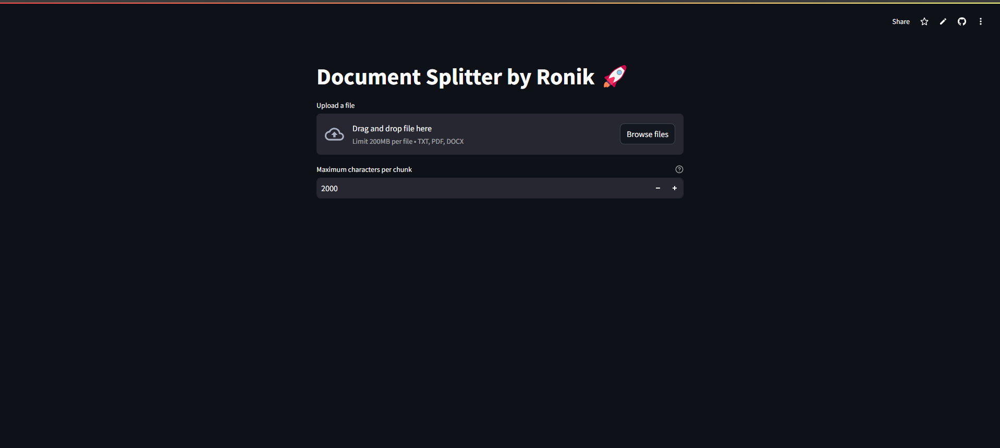

# Document Splitter App

A Streamlit-based web application for splitting text documents into manageable chunks with customizable size limits.

 <!-- Add a screenshot here if available -->

## Features

- **Multi-format Support**: Process TXT, PDF, and DOCX files
- **Custom Chunk Sizes**: Set maximum characters per chunk (100-10,000)
- **Real-time Preview**: See first two chunks before downloading
- **Easy Export**: Download results as formatted TXT file
- **Simple Interface**: User-friendly web-based GUI

---

## Prerequisites

- Python 3.7 or higher
- pip (Python package manager)

---

## Installation

1. **Clone the Repository**
    ```bash
    git clone https://github.com/your-username/rohandindokar-text_splitter.git
    cd rohandindokar-text_splitter
    ```

2. **Create and Activate Virtual Environment (Recommended)**
    ```bash
    python -m venv venv
    source venv/bin/activate  # On Linux/Mac
    venv\Scripts\activate     # On Windows
    ```

3. **Install Dependencies**
    ```bash
    pip install -r requirements.txt
    ```

---

## Usage

1. **Run the Application**
    ```bash
    streamlit run app.py
    ```
2. Open your browser and go to:
    - http://localhost:8501

3. **Upload a File**
    - Choose a TXT, PDF, or DOCX file
    - Set the desired maximum characters per chunk
    - View the first two chunks as a preview

4. **Download the Split Document**
    - Click the "Download Split Document as TXT" button

---

## Using Dev Containers (Optional)

This project includes a `.devcontainer` setup for easy development using VS Code and Docker.

1. Ensure Docker is installed and running.
2. Open the project in **VS Code**.
3. Install the [Dev Containers Extension](https://marketplace.visualstudio.com/items?itemName=ms-vscode-remote.remote-containers).
4. Select **Reopen in Container**.
5. The app will be available at `http://localhost:8501`.

---

## Contributing

Contributions are welcome! Please fork the repository and create a pull request.

---

## License

This project is licensed under the MIT License. See the [LICENSE](LICENSE) file for details.

